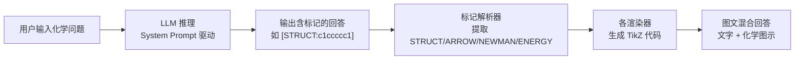

# Chem_Agent：给 LLM 装上化学的“眼睛”和“画笔”

[](https://www.python.org/downloads/)
[](https://opensource.org/licenses/MIT)

---

## 📖 项目简介

**Chem_Agent** 是一个为 LLM（大语言模型）设计的化学可视化增强引擎。它让 LLM 不仅能“思考”化学，更能“画出”化学。

当前，LLM 已能流畅解答各学科的专业问题，但在化学领域存在一个核心痛点：**输出端无法精准绘制反应机理、电子转移、势能面等图示内容**。Chem_Agent 通过一套轻量级的“渲染标记语言（Tag-based Rendering Language）”，让 LLM 在输出文字回答的同时，自动生成对应的化学结构式、反应箭头、机理图等可视化内容，实现真正的“图文并茂”。

> **核心理念**：LLM 是大脑（理解、推理、决策），Chem_Agent 是画笔（解析指令、渲染图像）。

---

## 🎯 项目目标

最终交付一个可接入清小搭等 AI 平台的 HTTP 服务，用户输入一个化学问题（可包含文字、结构式图片），系统返回一个**逻辑清晰、图文并茂**的回答。

---

## 🔍 解决的问题

| 维度         | 现有 LLM 的局限                    | Chem_Agent 的解决方案                          |
| :----------- | :--------------------------------- | :--------------------------------------------- |
| **结构式**   | 无法绘制键线式、Lewis 结构、楔形式 | 通过 `[STRUCT:SMILES]` 标记自动渲染结构式      |
| **反应机理** | 无法展示箭头转移、电子对移动       | 通过 `[ARROW:...]` 标记绘制带箭头的反应式      |
| **立体构象** | 无法展示 Newman 投影、环己烷构象   | 通过 `[NEWMAN:...]` 标记生成构象图             |
| **能量变化** | 无法绘制势能面、反应坐标图         | 通过 `[ENERGY:...]` 标记绘制能量曲线           |
| **推理过程** | 黑盒输出，用户看不到推理链条       | 通过 `[REASONING]...[/REASONING]` 展示思考过程 |

---

## 🧠 实现方式：三阶段策略

### 第一阶段：拆分（所有化学图示拆解为最小单元）

Chem_Agent 将化学图示拆分为三大类、若干最小单元。这些符号的选用和组装**完全由 LLM 自主决策**。

| 类别               | 包含内容                                                     | 示例               |
| :----------------- | :----------------------------------------------------------- | :----------------- |
| **结构式及其变体** | 键线式、结构式、结构简式、分子式、Lewis 结构式、楔形式       | 苯环、乙烷的交叉式 |
| **标注符号**       | 方程式加号（+）、反应箭头（→/⇌）、数字系数、反应位点加框、电荷标注（⊕/⊖）、电子转移箭头（弯箭头） | 亲电取代中的弯箭头 |
| **其他符号**       | 势能面曲线、电子云图、能级图、分子轨道图                     | 反应坐标-能量图    |

### 第二阶段：标记（LLM 输出标准化的渲染指令）

通过精心设计的 **System Prompt**，引导 LLM 在生成回答时，将上述化学符号以标准标记语法嵌入文本中：

```
[STRUCT:c1ccccc1,label=苯]          → 绘制带标注的苯环
[ARROW:c1ccccc1,c1ccccc1NO2,硝化]   → 绘制苯→硝基苯的反应箭头
[NEWMAN:CC,60]                      → 绘制乙烷的交叉式纽曼投影
[ENERGY:0,15,25,5,10]               → 绘制五点势能面图
[REASONING]亲电取代机理...[/REASONING] → 折叠展示推理过程
```

### 第三阶段：渲染（代码解析标记并生成图示）

Chem_Agent 的渲染引擎解析 LLM 输出中的标记，调用底层化学工具（RDKit、mol2chemfigPy3 等）生成对应的 TikZ 代码，最终嵌入回答中输出。



---

## 🏗️ 技术架构

```
/chem_agent
├── api.py                     # 清小搭接入服务（FastAPI，OpenAI 兼容协议）
├── app.py                     # 端到端管线：LLM → 标记解析 → 渲染 → 注入
├── streamlit_app.py           # Streamlit 网页入口
├── core/
│   ├── config.py              # 统一配置入口
│   ├── llm_client.py          # LLM API 调用封装
│   ├── tag_parser.py          # 标记解析器
│   ├── tag_injector.py        # 标记→TikZ 注入替换
│   └── prompt_manager.py      # System Prompt 管理
├── renderers/
│   ├── registry.py            # 标记调度表
│   ├── layout.py              # 统一坐标布局引擎（R-7）
│   ├── mol_primitives.py      # 共享分子绘制工具
│   ├── composite.py           # [COMPOSITE] 容器式复合标记渲染器
│   ├── structure.py           # [STRUCT] 渲染器
│   ├── lewis.py               # [LEWIS] 渲染器
│   ├── charge.py              # [CHARGE] 渲染器
│   ├── stereo.py              # [STEREO] 渲染器
│   ├── newman.py              # [NEWMAN] 渲染器
│   ├── hbond.py               # [HBOND] 渲染器
│   ├── arrow.py               # [ARROW] 渲染器
│   ├── retro.py               # [RETRO] 渲染器
│   ├── resonance.py           # [RESONANCE] 渲染器
│   ├── mechanism.py           # [MECH] 渲染器
│   ├── reaction.py            # [REACTION] 渲染器
│   ├── reaction_mech.py       # [REACTIONMECH] 渲染器
│   └── energy.py              # [ENERGY] 渲染器
├── utils/
│   ├── rdkit_utils.py         # RDKit 验证工具
│   ├── tikz_utils.py          # TikZ 代码美化
│   ├── latex_compile.py       # TikZ 代码编译为 PNG
│   └── ocr_utils.py           # 图片转 SMLES
├── prompts/
│   └── system_prompt.txt      # 核心 System Prompt
├── tests/                     # 单元测试
├── legacy/                    # MVP 旧代码（参考用）
└── requirements.txt
```

---

## 🚀 快速开始

### 环境要求

- Python 3.9+
- Conda（推荐）或 pip
- Java 8+（仅当使用 `pyopsin` 备选解析时）

### 安装步骤

```bash
# 1. 克隆项目
git clone <your-repo-url>
cd chem_agent

# 2. 创建并激活 Conda 环境
conda create -n chem_agent python=3.9
conda activate chem_agent

# 3. 安装依赖
pip install -r requirements.txt

# 4. 配置环境变量
cp .env.example .env
# 编辑 .env，填入你的 API_KEY 和 BASE_URL
# 接入清小搭时还需设置 SERVICE_API_KEY（服务端密钥）

# 5. 验证安装
python -c "from utils.rdkit_utils import validate_smiles; print(validate_smiles('C'))"
# 预期输出: True
```

### 本地测试

```bash
# 运行 Streamlit 界面（本地调试）
streamlit run streamlit_app.py

# 或运行清小搭接入服务（OpenAI 兼容协议）
uvicorn api:app --host 0.0.0.0 --port 8000
```

### API 调用示例

```bash
curl -X POST http://localhost:8000/v1/chat/completions \
  -H "Authorization: Bearer 你的SERVICE_API_KEY" \
  -H "Content-Type: application/json" \
  -d '{
    "messages": [{"role": "user", "content": "画出苯的结构式，并说明其分子式"}],
    "stream": false
  }'
```

---

## 📦 核心依赖

| 库                    | 用途                                    |
| :-------------------- | :-------------------------------------- |
| `rdkit`               | 化学信息学核心（SMILES 验证、分子操作） |
| `mol2chemfigPy3`      | SMILES → chemfig (TikZ) 转换            |
| `fastapi` + `uvicorn` | HTTP 服务（清小搭接入）                 |
| `streamlit`           | 本地 Web 界面（调试用）                 |
| `python-dotenv`       | 环境变量管理                            |
| `openai` / `requests` | LLM API 调用                            |

---

## 🛣️ 开发路线图

| 阶段        | 目标                         | 状态     |
| :---------- | :--------------------------- | :------- |
| **MVP**     | 名称→SMILES→TikZ 结构式渲染  | ✅ 已完成 |
| **Phase 1** | 转型为 LLM 驱动 + 标记解析器 | ✅ 已完成 |
| **Phase 2** | FastAPI 适配 + 清小搭接入    | ✅ 已完成 |

---

## 🤝 贡献

欢迎提交 Issue 和 Pull Request。如有疑问，请联系项目维护者。

---

## 📄 许可证

[MIT](LICENSE)

---

## 🙏 致谢

- [RDKit](https://www.rdkit.org/) - 化学信息学工具包
- [mol2chemfigPy3](https://github.com/mcs07/mol2chemfig) - SMILES 转 chemfig
- [清小搭](https://www.xiaoda.tsinghua.edu.cn) - AI 智能体平台