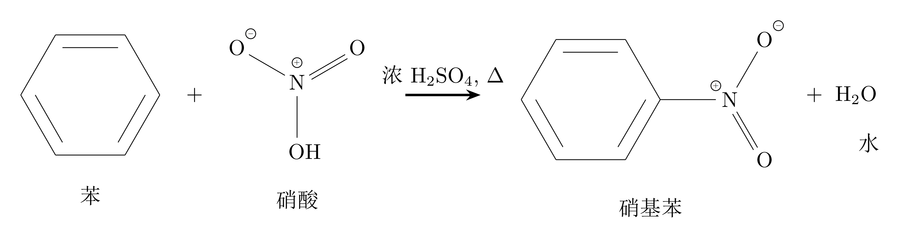
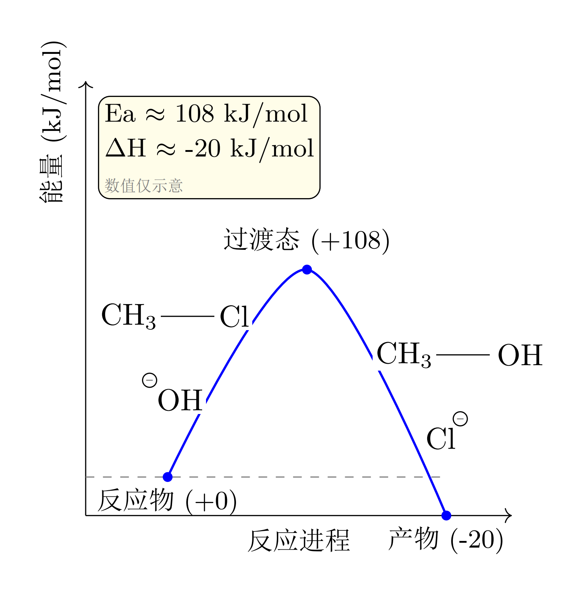
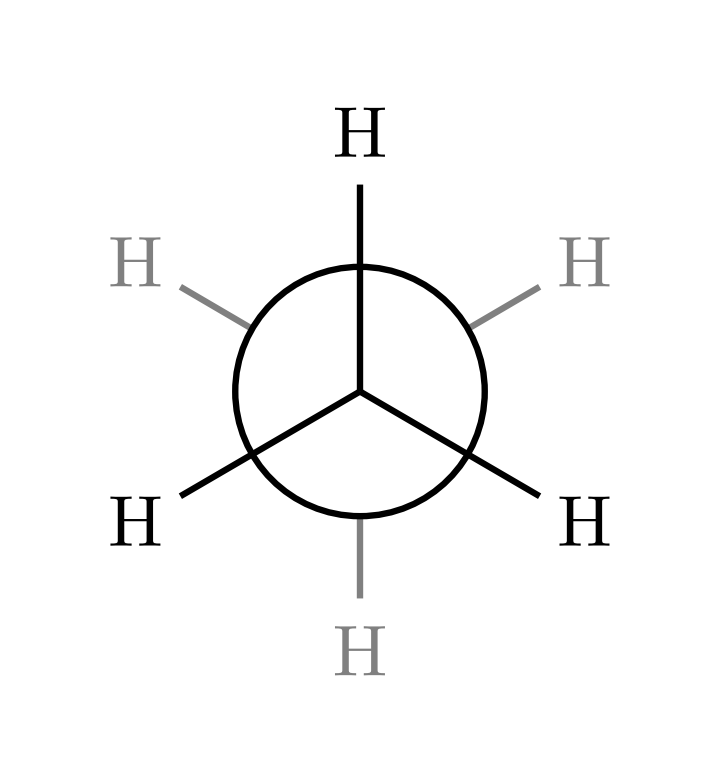
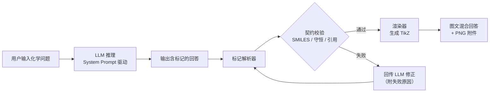

# Chem_Agent：给 LLM 装上化学的“眼睛”和“画笔”

[](https://www.python.org/downloads/)
[](https://opensource.org/licenses/MIT)

---

## 📖 项目简介

**Chem_Agent** 是一个为 LLM（大语言模型）设计的化学可视化增强引擎。它让 LLM 不仅能“思考”化学，更能“画出”化学。

当前，LLM 已能流畅解答各学科的专业问题，但在化学领域存在一个核心痛点：**输出端无法精准绘制反应机理、电子转移、势能面等图示内容**。Chem_Agent 通过一套轻量级的“渲染标记语言（Tag-based Rendering Language）”，让 LLM 在输出文字回答的同时，自动生成对应的化学结构式、反应式、机理图等可视化内容，实现真正的“图文并茂”。

> **核心理念**：LLM 是大脑（理解、推理、决策），Chem_Agent 是画笔（解析指令、渲染图像），也是校验尺（**生成 → 校验 → 修正 → 交付的可靠性闭环**——不让错误图示静默到达用户）。
>
> **English abstract**: Chem_Agent is a chemistry-visualization engine for LLMs. The model embeds lightweight rendering tags (`[STRUCT]` / `[COMPOSITE]` / `[ENERGY]` / `[REASONING]`) in its answers; a pipeline then parses the tags, validates them against chemical contracts, feeds failures back to the LLM for repair, renders TikZ figures, and injects the results — image-rich chemistry answers, with invalid figures never silently reaching the user.

---

## 🎯 项目目标

项目本体是一条**化学问答管线**：用户输入化学问题（可含文字、结构式图片），
系统返回**逻辑清晰、图文并茂**的回答。管线末端可接多种形态，当前实现三种：

| 末端 | 形态 | 入口 |
| :--- | :--- | :--- |
| **HTTP 服务（OpenAI 兼容）** | 接入清小搭等 AI 平台（`/v1/*`，Bearer 鉴权，SSE 流式，图片附件） | `api.py` |
| **公开网页（BYOK）** | 任意访客填自己的 API Key 即用（`/chat`，密钥只存浏览器） | `api.py` + `web/index.html` |
| **本地 Streamlit 界面** | 开发调试与本地使用 | `streamlit_app.py` |

三种形态共用同一条管线（LLM → 标记解析 → 契约校验 → 修正 → 渲染 → 注入），互不影响。

---

## 🔍 解决的问题

| 维度 | 现有 LLM 的局限 | Chem_Agent 的解决方案 |
| :--- | :------------- | :------------------- |
| **结构式** | 无法绘制键线式、Lewis 结构、楔形式、椅式构象、Newman 投影 | `[STRUCT:SMILES]` + mode 绘制全部画法变体 |
| **反应式/机理** | 无法绘制配平的反应式、电子转移弯箭头、多步序列 | `[COMPOSITE]` 容器：组件 + 箭头 + 机理弯箭头统一坐标系组装 |
| **共振与立体** | 无法绘制共振块、构象翻转对比 | `[BLOCK]` 共振块、row 布局横向排列 |
| **能量变化** | 无法绘制势能面、驻点结构 | `[ENERGY:点序列]` + energy 布局驻点挂载 |
| **推理过程** | 黑盒输出，复杂机理直接写标记易错 | `[REASONING]...[/REASONING]` 思考规划空间：复杂图先在此规划步骤、数清原子编号（内容不进入最终回答） |
| **可靠性** | 化学图示错了也静默通过 | 标记契约校验层（SMILES/守恒/引用）+ 失败自动回传修正 |

---

## 🖼️ 渲染效果示例

**[COMPOSITE] 反应式**



| **[ENERGY] 势能面** | **[STRUCT] mode=newman 投影** |
| :---: | :---: |
|  |  |

---

## 🧠 实现方式

### 三阶段策略

**第一阶段：拆分**——所有化学图示拆解为最小单元（结构组件、连接符、机理箭头、标注），符号的选用和组装完全由 LLM 自主决策。

**第二阶段：标记**——通过精心设计的 System Prompt，引导 LLM 将化学符号以标准标记语法嵌入文本：

```text
[STRUCT:c1ccccc1,label=苯]               → 绘制带标注的苯环（芳香小写画圈）
[STRUCT:CC,mode=newman,bond=0-1,angle=60] → 绘制乙烷交叉式纽曼投影
[COMPOSITE:reaction]                      → 苯的硝化反应式：
  [STRUCT:C1=CC=CC=C1,label=苯][PLUS][STRUCT:O=[N+]([O-])O,label=硝酸]
  [ARROW:type=single,浓H2SO4, Δ]
  [STRUCT:O=[N+]([O-])C1=CC=CC=C1,label=硝基苯][PLUS][STRUCT:O,label=水]
[/COMPOSITE]
[ENERGY:0,108,-20]                        → 绘制三点势能面图
[REASONING]亲电取代机理...[/REASONING]     → 思考规划空间（不进入最终回答）
```

**第三阶段：渲染**——渲染引擎解析标记，基于 RDKit 计算分子几何，自绘 TikZ（键线式、孤对电子、弯箭头、布局防重叠），最终注入回答输出。

### 可靠性闭环（核心差异化）



- **契约校验层**：渲染前拦截非法 SMILES、原子/电荷不守恒、越界引用、格式错误；
- **失败回传修正**：失败标记连同原因回传 LLM 部分修正（不重写全文），修正耗尽则友好降级（宁可不画，不画错）；
- **单模型 + 思考档位**：整个服务只用一个模型（经 `MODEL_NAME` 配置，但若模型不具备识图能力还需配置视觉模型 `VISION_MODEL`）；成本与延迟由用户可见的两个正交开关控制——**思考开关**（开/关）与**思考强度**（低/中/高/最大）；端点不配合（强制思考、不认某档位）时自动摘字段适配并如实告知，不静默照做。

---

## 🏗️ 技术架构

```text
/chem_agent
├── api.py                     # 清小搭接入服务（FastAPI，OpenAI 兼容协议）
├── app.py                     # 端到端管线：LLM → 解析 → 校验 → 修正 → 渲染 → 注入
├── streamlit_app.py           # Streamlit 网页入口
├── core/
│   ├── config.py              # 统一配置入口（模型 + 思考开关/强度/最大输出 + 视觉组）
│   ├── credentials.py         # 每请求凭证与参数（BYOK）：请求头 → contextvar
│   ├── capabilities.py        # 端点能力表（思考参数的学习与记忆，按 端点+模型 分键）
│   ├── llm_client.py          # LLM API 调用封装（流式、思考档位映射与降级、字段自适应）
│   ├── tag_parser.py          # 标记解析器
│   ├── tag_validator.py       # 标记契约校验层
│   ├── readback.py            # 生成-回读协议（RDKit 确定性摘要对照 + 骨架漂移检查）
│   ├── tag_injector.py        # 标记→TikZ 注入替换
│   ├── prompt_manager.py      # System Prompt 管理
│   ├── electron_sim.py        # 电子流模拟器（机理箭头自洽性深层校验）
│   ├── attachments.py         # TikZ→PNG 附件构建（编译、托管、超配额回收）
│   ├── answer_cache.py        # 多轮对话标记恢复（渲染后文本 → 原始标记）
│   ├── web_api.py             # 公开网页后端（/api/chat、BYOK 凭证、限流、会话附件）
│   ├── replay.py              # 离线重放工具（标记管线归因：校验 trace + 渲染状态）
│   ├── diaglog.py             # 诊断日志（失败标记与原始输出落盘，0600 滚动）
│   ├── metrics.py             # 基线评测（标记遵循率 / 端到端管线）
│   └── rule_stats.py          # 校验规则归因统计（评测语料 + autofix 覆盖分析）
├── renderers/
│   ├── registry.py            # 标记调度表
│   ├── layout.py              # 统一坐标布局引擎
│   ├── mol_primitives.py      # 共享分子绘制原语（键线/孤对电子/弯箭头/标签）
│   ├── composite.py           # [COMPOSITE] 容器式复合标记渲染器（核心）
│   ├── structure.py           # [STRUCT] 渲染器（分子家族 mode 分派）
│   ├── lewis.py / stereo.py / chair.py / newman.py   # 画法变体
│   ├── energy.py              # [ENERGY] 势能面渲染器
│   ├── hbond.py               # 氢键渲染器
│   └── collide.py             # 占据注册表（布局避让）
├── utils/
│   ├── rdkit_utils.py         # RDKit 验证工具
│   ├── latex_compile.py       # TikZ 编译为 PNG
│   ├── ocr_utils.py           # 图片多模态理解（视觉模型）
│   ├── name_resolver.py       # 化学名称 → SMILES（PubChem 兜底）
│   └── tempdir.py             # 临时目录探测（沙箱/只读 /tmp 环境兜底）
├── prompts/
│   ├── system_prompt.txt      # 核心 System Prompt
│   ├── mech_arrow_prompt.txt       # 机理弯箭头修正专用 System Prompt（回传修正）
│   ├── struct_rewrite_prompt.txt   # STRUCT 重写专用 System Prompt（回传修正）
│   └── Instruction-for-SMILES.md   # SMILES 书写规范
├── web/
│   └── index.html             # 公开网页（BYOK，自包含单文件，无需构建）
├── deploy/                    # 部署模板（systemd 单元 + Nginx 反代）
├── docs/                      # 项目文档（deploy.md 部署 / testing.md 测试）
├── tests/                     # 单元测试（700+ 项，含示例一致性审计）
├── legacy/                    # MVP 旧代码（存档保留）
├── pytest.ini                 # pytest 配置
├── .env.example               # 环境变量模板（复制为 .env 后填写）
└── requirements.txt           # 依赖清单
```

---

## 🚀 快速开始

### 环境要求

- Python 3.10+
- Conda（推荐）或 pip
- LaTeX 工具链（仅当需要 PNG 附件/图片输出时）：
  `xelatex`（Debian/Ubuntu: `texlive-xetex texlive-latex-extra texlive-lang-chinese`）+ `poppler-utils`

### 安装步骤

```bash
# 1. 克隆项目
git clone <your-repo-url>
cd chem_agent

# 2. 创建并激活 Conda 环境
conda create -n chem_agent python=3.10
conda activate chem_agent

# 3. 安装依赖
pip install -r requirements.txt

# 4. 配置环境变量
cp .env.example .env
# 编辑 .env，填入 API_KEY / BASE_URL / MODEL_NAME
#   MODEL_NAME=deepseek-flash      ← 整个服务只用一个模型（旧名 v4-flash/v4-pro 已退役）
#   THINKING_DEFAULT=on            ← 思考开关 on/off（网页用户可各自覆盖）
#   EFFORT_DEFAULT=low             ← 思考强度 low/medium/high/max
#   MAX_TOKENS=32768               ← 上限而非预留，按实际用量计费
# 可选：VISION_*（仅当主模型不支持图片识别时才需要；原生多模态模型留空即可）
# 可选：CHEM_AGENT_TMPDIR（只读 /tmp 的容器里指定可写临时目录；见 docs/deploy.md §2.2）
# 接入清小搭时还需设置 SERVICE_API_KEY（服务端密钥）
# 完整变量清单与历史变量迁移说明：见 .env.example 与 docs/deploy.md

# 5. 验证安装
python -c "from utils.rdkit_utils import validate_smiles; print(validate_smiles('C'))"
# 预期输出: True
```

### 本地测试

```bash
# 运行 Streamlit 界面（本地调试）
streamlit run streamlit_app.py

# 或运行清小搭接入服务（OpenAI 兼容协议）
uvicorn api:app --host 0.0.0.0 --port 8000
```

### 运行测试

```bash
python -m pytest tests/ -q
```

用例组织、渲染器离线 demo 与示例一致性审计等专项验证方法见 `docs/testing.md`。

### API 调用示例

```bash
curl -X POST http://localhost:8000/v1/chat/completions \
  -H "Authorization: Bearer 你的SERVICE_API_KEY" \
  -H "Content-Type: application/json" \
  -d '{
    "messages": [{"role": "user", "content": "画出苯的结构式，并说明其分子式"}],
    "stream": false
  }'
```

服务特性：Bearer 鉴权、SSE 流式、多模态图片/音频/文件输入（OCR 理解结构式图片）、`x_soda.attachments` 图片附件输出（TikZ→PNG 编译 + 托管下载）。

### 公开网页（BYOK：用户填自己的 API Key）

除清小搭接入外，服务同时提供**面向任意用户的公开网页**——不需要服务器提供任何密钥，访问者填自己的 OpenAI 兼容凭证即可使用，由他自己的账号计费：

```bash
uvicorn api:app --host 0.0.0.0 --port 8000
# 浏览器打开：http://localhost:8000/chat
```

- **界面**：自包含单页（`web/index.html`，零构建、零 CDN 依赖）——设置面板填 `API Key / 接口地址 / 模型` 与两个思考控件 `思考（开/关）`、`思考强度（低/中/高/最大）`，可选 `最大输出`、`视觉模型`（**留空即用主模型识图**）、`视觉端点/Key/思考参数`；「测试连接」会顺带**探测该端点的思考能力**（能否关闭、是否接受档位）并显示结论。对话流式输出，图示以 PNG 内联显示，支持上传结构式图片、多轮追问、会话本地保留。
- **密钥处理**：密钥只存在浏览器 `sessionStorage`（关标签页即失效），随请求头  一次性发给服务端——**不落盘、不写日志、不回显**；整条管线全程只用该用户的凭证，且 BYOK 路径不继承服务器 `.env` 的任何模型/端点/视觉配置。
- **隐私**：仅用于排查化学图示渲染/校验失败的**提问原文与模型原始输出**会记入服务端诊断日志（不含 API Key，滚动覆盖、仅运维可读），页面设置面板有「隐私说明」告知；对话正文只保存在访客自己的浏览器里。
- **安全**：接口地址做 SSRF 校验（拒绝内网/回环/云元数据地址）、每 IP 限流、问题长度与图片数上限；出站请求**不跟随重定向**，因此「接口地址」要填
  **最终的**完整地址；LaTeX 编译另有文件访问限制与源码闸门。设计依据与运维细节见 `docs/deploy.md` §2.6。
- **与清小搭互不影响**：`/v1/*` 契约与鉴权一字未改，两类调用方共用同一条化学渲染与契约校验管线。
- 端点：`GET /chat`（或 `/web`）页面、`POST /api/chat`（`stream=true` 走 SSE）、`GET /api/web-config`、`GET /api/session/{会话}/{uuid}.png`。

部署（Nginx/HTTPS/systemd 与验收清单）见 `docs/deploy.md`。

---

## 📦 核心依赖

| 库 | 用途 |
| :- | :--- |
| `rdkit` | 化学信息学核心（SMILES 解析验证、分子几何计算） |
| `fastapi` + `uvicorn` | HTTP 服务（清小搭接入） |
| `streamlit` | 本地 Web 界面（调试用） |
| `requests` | LLM API 调用（OpenAI 兼容，SSE 流式） |
| `python-dotenv` | 环境变量管理 |
| `PyMuPDF` | PDF → PNG（图片附件） |
| `curl_cffi` | PubChem 访问（名称→SMILES 兜底） |

---

## 🛣️ 开发路线图

| 阶段 | 目标 | 状态 |
| :--- | :--- | :--- |
| **MVP** | 名称→SMILES→TikZ 结构式渲染 | ✅ 已完成 |
| **Phase 1** | 转型为 LLM 驱动 + 标记解析器 | ✅ 已完成 |
| **Phase 2** | FastAPI 适配 + 清小搭接入 | ✅ 已完成 |
| **Phase 3** | 标记面收敛（STRUCT 家族 + COMPOSITE）+ 可靠性工程（契约校验 / 修正闭环 / 模型路由） | ✅ 已完成 |
| **Phase 4** | 化学正确性增强（确定性化学规则校验、LLM 复审、机理箭头样式优化） | 🚧 进行中 |
| **Phase 5** | 开放使用形态：公开网页 BYOK（用户自带 API Key）+ 每请求凭证隔离 + 部署模板 | ✅ 已完成 |
| **Phase 6** | 模型与思考参数重构：单模型 + 思考开关×强度暴露给用户 + 端点能力表与参数自适应 + 视觉组独立配置 | ✅ 已完成 |

---

## ⚠️ 已知限制

- **LaTeX 工具链强依赖**：PNG 图示附件需要 `xelatex` + `poppler-utils`；未安装时回答正常返回，但图示只显示裸 TikZ 源码、无图片。
- **标记覆盖边界**：只渲染已定义的标记类型与画法变体；超出能力边界的复杂图会被主动降级为文字描述（宁可不画，不画错），不承诺任意化学图示都能成图。
- **名称兜底需外网**：化学名称 → SMILES 的 PubChem 兜底需要外网访问；离线环境请在提问中直接提供 SMILES。

---

## 🤝 贡献

欢迎提交 Issue 和 Pull Request。使用问题请直接在 Issue 中描述（附报错与复现步骤更佳）。

---

## 📄 许可证

[MIT](LICENSE)

---

## 🙏 致谢

- [RDKit](https://www.rdkit.org/) - 化学信息学工具包
- [清小搭](https://www.xiaoda.tsinghua.edu.cn) - AI 智能体平台
